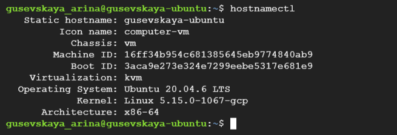
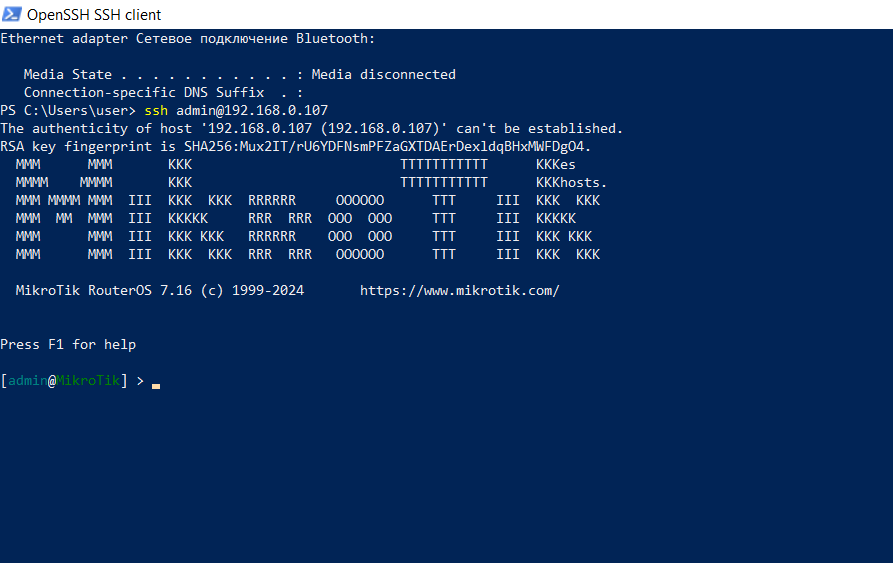
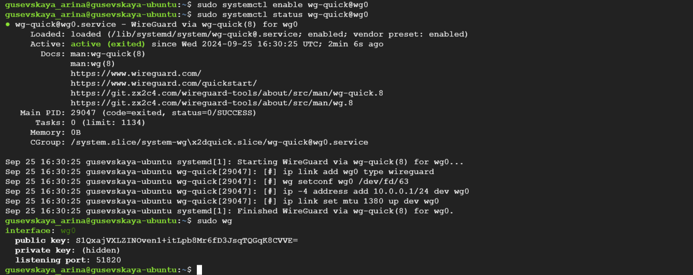
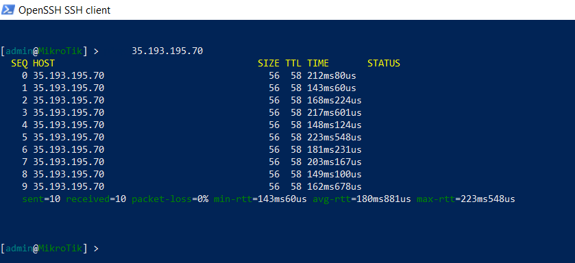

University: [ITMO University](https://itmo.ru/ru/)  
Faculty: [FICT](https://fict.itmo.ru)  
Course: [Network programming](https://github.com/itmo-ict-faculty/network-programming)  
Year: 2024/2025  
Group: K34202  
Author: Gusevskaya Arina  
Lab: Lab1  
Date of create: 25.09.2024  
Date of finished: 26.09.2024 

## Лабораторная работа №1 "Установка CHR и Ansible, настройка VPN"

<b>Описание:</b> данная работа предусматривает обучение развертыванию виртуальных машин (VM) и системы контроля конфигураций Ansible а также организации собственных VPN серверов.
<p><b>Цель работы:</b> развернуть виртуальную машину на базе платформы GCP с установленной системой контроля конфигураций Ansible и установить CHR в VirtualBox.</p>

### Ход работы
#### Создание ВМ на GCP
1. Создадим ВМ в Google Cloud на образе Ubuntu 20.04


2. Проверим конфигурацию и корректность работы ВМ.




3. Установим python3 и ansible. Убедимся, что всё установлено корректно.
   
P.S. В команде проверки `ls -la /usr/bin/python3*` используем символ *, потому что мы не знаем, какая конкретно версия установлена и не можем её указать.


#### Установка CHR (RouterOS) на VirtualBox
1. Создадим ВМ с помощью Oracle VirtualBox с образом, который был скачат с сайта mikrotik.com.


2. Узнаем ip-адресс СНR.


3. Подключимся по ssh через Windows PowerShell. Подключение выполнилось успешно не сразу (см. ниже).



<details>
   
<summary><b>Возникшие трудности</b></summary>
<p></p>


В изначальном варианте при выполнении команды `ip address print` был выдан ip: 10.0.2.15. Подключение по shh выдавало ошибку ssh: `connect to host 10.0.2.15 port 22: Connection timed out`.


Мне пришлось изучить много разных материалов по этой проблеме и потратить годы...(ну или немного меньше). Конечно, я делала проброс портов и диагностику, конфигурацию ssh, отключение firewall и всё такое. НО в этот раз мне попалась статья от доброго человека на Яндекс Дзен, который освежил в моей голове простые истины и всё получилось. [Ссылка](https://dzen.ru/a/YyBI-9K0nk2MWmSd) на статью.

CHR получил адекватный адрес и подключение прошло успешно!

</details>

#### Cоздание Wireguard сервера для организации VPN туннеля между сервером автоматизации, где была установлена система контроля конфигураций Ansible, и локальным CHR.

> Пара слов о том, почему я выбрала Wireguard. При изучени вопроса "Что лучше: Wireguard или OpenVPN" я наткнулась на интересную [статью](https://habr.com/ru/companies/ruvds/articles/537010/) на Хабре, где приводилась настройка защищенного соединения Wireguard, а также его плюсы и минусы. Я решила, что на данном этапе мне будет интересно поработать именно с Wireguard.

```bash
sudo apt update
sudo apt install wireguard iptables
```
1. Сгенерируем приватный и публичный ключи на GCP ВМ.


2. Для настройки сервера создадим конфигурационный файл в `/etc/wireguard/wg0.conf` и добавим необходимые записи.


3. Посмотрим статус Wireguard, убедимся, что всё работает.



4. Сгенерируем ключи на CHR (и обменяемся ключами с GCP).


5. Настроим VPN туннель между VPN сервером на Ubuntu и VPN клиентом на RouterOS (CHR).


### Проверка доступности

Проверим доступ сервера (GCP) к клиенту (CHR).


Поверим доступ клиента к серверу.




Все пинги прошли успешно! Цель работы достигнута.

### Вывод
В ходе лабораторной работы была развернута виртуальная машина на базе платформы GCP с установленной системой контроля конфигураций Ansible, а также CHR в VirtualBox. Между ними был настроен WireGuard туннель.
